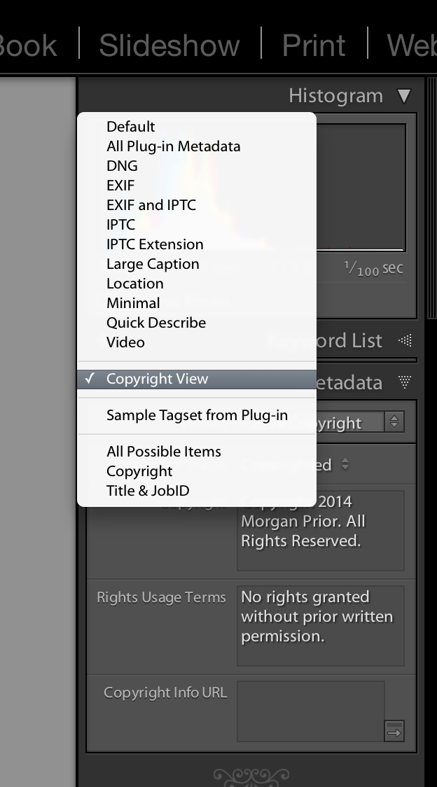
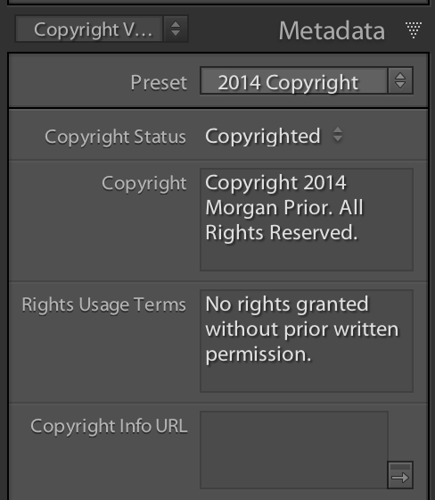

CopyrightMetadataTagset
==

Lightroom plugin for Copyright Metadata filter in Library mode.

Download and add as usual lightroom plugin. In Library mode you can select the Copyrightview to  see metadata only related to copyright.

The Metadata view should now only show 4 fields:

